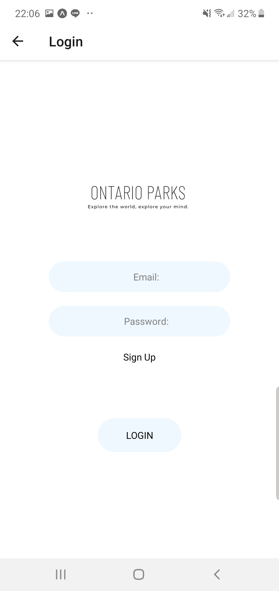
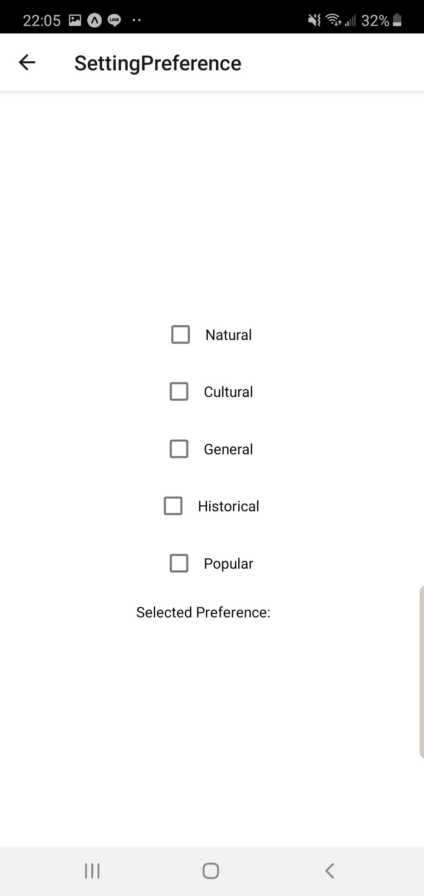
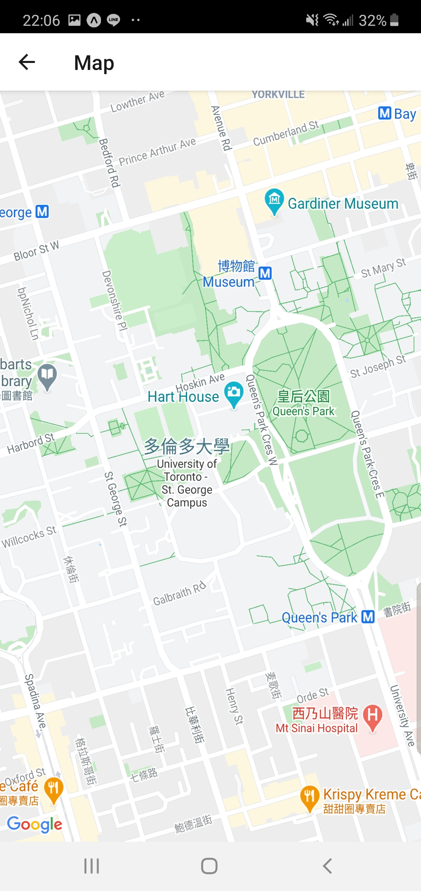

# Ontario Parks Audio Tour App

A mobile application that enhances the travel experience through Ontario by providing location-based audio tours of parks, cultural sites, and points of interest.

## Overview

This React Native application was developed in collaboration with Ontario Parks to create an interactive audio guide system. The app delivers contextual information about nearby attractions based on user location and preferences, introducing travelers to Ontario's diverse landscapes, cultures, and histories.

## Features

### Core Functionality

- **Interactive Map Interface**: Browse and explore points of interest across Ontario parks and surrounding areas
- **Audio Tours**: Listen to professionally narrated descriptions of locations, available in both full-length and short "hook" formats
- **Location-Based Content**: Automatic content delivery based on GPS location
- **Interest Categories**: Filter content by cultural, agricultural, natural, historical, and Indigenous points of interest

### User Management

- **Account System**: Optional user registration and authentication
- **Cross-Device Sync**: Access your preferences and settings across multiple devices
- **Guest Access**: Use the app without creating an account

### Customization

- **Personalized Preferences**: Select which types of points of interest you want to see
- **Audio Settings**: Choose between full audio tours or brief highlights
- **User Profiles**: Manage your account settings and preferences

## Screenshots

<table>
  <tr>
    <td><b>Login Screen</b></td>
    <td><b>Settings</b></td>
    <td><b>Map</b></td>
  </tr>
  <tr>
    <td></td>
    <td></td>
    <td></td>
  </tr>
</table>

## Technology Stack

- **Frontend**: React Native with Expo
- **Backend**: Node.js
- **Mobile Support**: iOS and Android via Expo Go
- **Development**: Web browser preview available during development

## Getting Started

### Prerequisites

- Node.js (Download from [nodejs.org](https://nodejs.org/en/download/))
- npm (included with Node.js)
- Expo CLI
- iOS device with Expo Go, or Android device with Expo (optional, for mobile testing)

### Installation

1. **Install Expo CLI globally**

   ```bash
   # Windows
   npm install expo-cli --global
   
   # macOS/Linux
   sudo npm install expo-cli --global
   ```

2. **Clone the repository**

   ```bash
   git clone https://github.com/Edward9292/ontario-parks-app.git
   cd ontario-parks-app
   ```

3. **Install dependencies**

   ```bash
   cd frontend
   npm install
   ```

4. **Start the development server**

   ```bash
   expo start
   ```

   This will open a browser window with the Expo Developer Tools and display a QR code in your terminal.

### Running on Mobile Devices

1. **iOS**: Download [Expo Go](https://apps.apple.com/app/expo-go/id982107779) from the App Store
2. **Android**: Download [Expo](https://play.google.com/store/apps/details?id=host.exp.exponent) from Google Play Store
3. Scan the QR code displayed in your terminal or browser to launch the app

## Usage

1. **First Launch**: Open the app to see the main menu with options to login, view the map, or adjust settings
2. **Guest Mode**: Tap "Map" to immediately start exploring without an account
3. **Create Account** (Optional): Tap "Login" → "Sign Up" to create an account for cross-device access
4. **Customize Experience**: Access Settings to select your interests and audio preferences
5. **Explore**: Navigate the map and tap on points of interest to read descriptions and play audio tours

## Project Background

This application was developed in collaboration with Ontario Parks to improve visitor experience and engagement. The system helps travelers discover locations, cultures, histories, and attractions they might otherwise miss during their journey through Ontario.

**Partner Organization**: Ontario Parks

### My Contributions

This was a collaborative project where I focused on:
- User authentication system (login/registration)
- User profile management and settings
- Cross-device preference synchronization
- Google Map and location tracking integration

